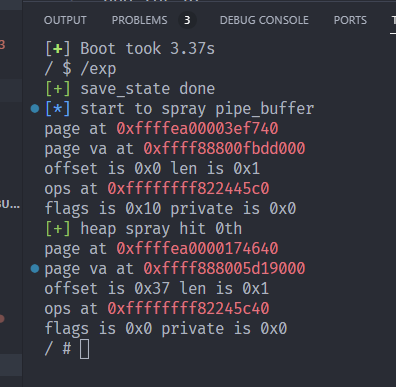

# 几个问题的解决
- pipe的续写机制 ?
- 怎么确定喷到了哪个pipe_buffer ?
pipe往head上写 从tail开始读
```
   285                 if (!pipe_empty(head, tail)) {
   286                         struct pipe_buffer *buf = &pipe->bufs[tail & mask];
   287                         size_t chars = buf->len;
   288                         size_t written;
   289                         int error;
   290 
 ► 291                         if (chars > total_len) {
   292                                 if (buf->flags & PIPE_BUF_FLAG_WHOLE) {
   293                                         if (ret == 0)
   294                                                 ret = -ENOBUFS;
   295                                         break;
   296                                 }
   297                                 chars = total_len;
   298                         }
   299 
   300                         error = pipe_buf_confirm(pipe, buf);
   301                         if (error) {
─────────────────────────────────────────[ EXPRESSIONS ]─────────────────────────────────────────
1: *(struct pipe_buffer *) 0xffff88800509e800 = {
  page = 0xffffea00003ee880,
  offset = 0,
  len = 16,
  ops = 0xffffffff822445c0 <anon_pipe_buf_ops>,
  flags = 16,
  private = 0
}
─────────────────────────────────────────────────────────────────────────────────────────────────
pwndbg> p chars      写入的总size
$6 = 16
pwndbg> p total_len  需要读出的size
$7 = 1
```

然后会调整offset
```
   307                         written = copy_page_to_iter(buf->page, buf->offset, chars, to);
 ► 308                         if (unlikely(written < chars)) {
   309                                 if (!ret)
   310                                         ret = -EFAULT;
   311                                 break;
   312                         }
   313                         ret += chars;
   314                         buf->offset += chars;
   315                         buf->len -= chars;
```
所以可以看到 offset为页内偏移 [offset; offset + len]为页内数据的区间
可以通过读写操作来 


- 可不可以改pipe_buffer的offset ?

# setuid 编译

`setuid` demo如下 只要注入某个setuid程序为setuid+system 就能完成dp的利用
```shell
$ gcc -o shell shell.c
$ sudo chown root:root shell
$ sudo chmod u+x shell      
$ sudo chmod +s shell 
```

```c
#include <stdio.h>
#include <unistd.h>
#include <stdlib.h>

int main(int argc, char const *argv[])
{
    setuid(0);
    system("/bin/sh");

    return 0;
}
```

# setuid 程序偏移

busybox里面没有setuid程序 可以自己随便编译一个丢进去 方便我们注入
可以通过readelf找到其中的偏移
这里虚拟地址起始地址是0x400000 偏移是0x1038 在splice的时候给入偏移0x37即可
```shell
$ readelf --headers fs/bin/test
ELF Header:
  Magic:   7f 45 4c 46 02 01 01 00 00 00 00 00 00 00 00 00 
  Class:                             ELF64
  Data:                              2's complement, little endian
  Version:                           1 (current)
  OS/ABI:                            UNIX - System V
  ABI Version:                       0
  Type:                              EXEC (Executable file)
  Machine:                           Advanced Micro Devices X86-64
  Version:                           0x1
  Entry point address:               0x401038
```


# extra

## 编译报错

```
$ make 
make -C /home/squ/src-code-reading/linux-5.19/ M=/home/squ/prac/dirty-pipe-primitive-demo/vuln_module modules && \
// cp vuln.ko .. && \
// rm -rf .*.cmd *.symvers *.order *.ko *.mod* *.o
make[1]: Entering directory '/home/squ/src-code-reading/linux-5.19'
WARNING: Symbol version dump "Module.symvers" is missing.
         Modules may not have dependencies or modversions.
         You may get many unresolved symbol warnings.
make[3]: *** No rule to make target 'scripts/module.lds', needed by '/home/squ/prac/dirty-pipe-primitive-demo/vuln_module/vuln.ko'.  Stop.
make[2]: *** [scripts/Makefile.modpost:134: __modpost] Error 2
make[1]: *** [Makefile:1757: modules] Error 2
make[1]: Leaving directory '/home/squ/src-code-reading/linux-5.19'
make: *** [Makefile:12: default] Error 2
```

解决思路 到内核树下`make modules_prepare`

`Module.symvers`和`vmlinux.symvers`貌似是一个东西